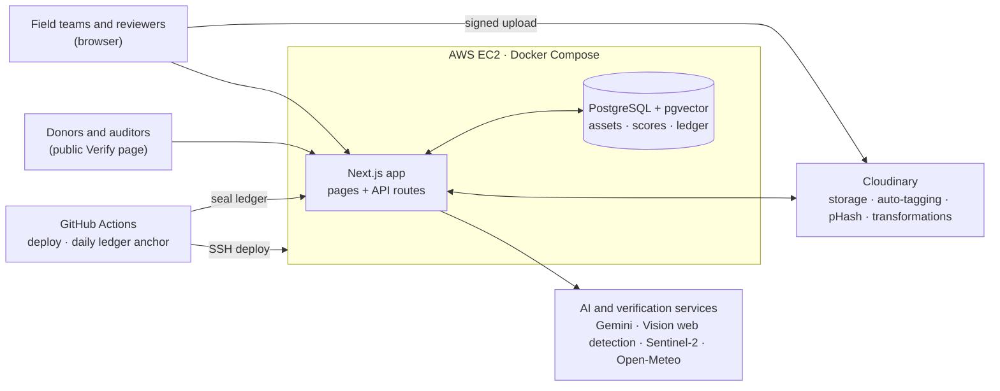

# EcoEvidence

A proof-of-impact media platform for NGOs, CSR teams and public programmes. Upload field photos and videos, organize them with AI, and verify each one before it appears in a report. Built on Cloudinary.

## Features

- **Evidence library.** Direct-to-Cloudinary uploads, AI tags and categories, and semantic search.
- **Trust Score.** Every photo is scored 0–100 by nine checks: duplicates, recycled images, web matches, EXIF, geofence, weather, satellite imagery, an AI auditor and provenance.
- **Tamper-evident ledger.** Every action is hash-chained and anchored daily in this repository.
- **Before/after evidence.** Verified photo pairs, measured change, and reels built from Cloudinary transformations.
- **Reports.** PDF reports that link each photo to its public verification page.

## Architecture



**How a photo is verified**

1. The browser uploads straight to Cloudinary with a server-signed request. Cloudinary returns tags, EXIF data and a perceptual hash.
2. The app stores the asset in PostgreSQL and runs the nine Trust Score checks against Cloudinary, Gemini, Google Vision, Sentinel-2 and Open-Meteo.
3. The score, and every later action on the photo, is appended to the hash-chained ledger. A daily GitHub Action seals the ledger with a Merkle root committed to this repository.
4. Verified photos feed search, before/after comparisons, reels and PDF reports. Each one links to its public Verify page.

## Tech stack

Next.js 14 · TypeScript · PostgreSQL + pgvector (Prisma) · Cloudinary · Google Gemini · Docker

## Getting started

```bash
cp .env.example .env          # add your Cloudinary keys and GEMINI_API_KEY
docker compose up -d --build
```

The app runs at http://localhost:3000. To load five sample projects, run `npm install && npm run demo:data`.

To run without Docker, you need Node.js 20+ and PostgreSQL with pgvector. Set `DATABASE_URL` in `.env`, then run `npm install`, `npm run db:setup` and `npm run dev`.

## Configuration

| | Variables |
|---|---|
| Required | `CLOUDINARY_CLOUD_NAME`, `CLOUDINARY_API_KEY`, `CLOUDINARY_API_SECRET`, `NEXTAUTH_URL`, `NEXTAUTH_SECRET` |
| Recommended | `GEMINI_API_KEY` |
| Optional | `GOOGLE_VISION_API_KEY`, `COPERNICUS_CLIENT_ID`, `COPERNICUS_CLIENT_SECRET`, `PUBLIC_BASE_URL`, `ANCHOR_TOKEN` |

See [`.env.example`](.env.example) for details. Checks without a configured service are skipped.

## Deployment

Every push to `main` deploys to EC2 through GitHub Actions ([`scripts/ops/deploy.sh`](scripts/ops/deploy.sh)). The running site is replaced only after the new build succeeds.

## License

[MIT](LICENSE)
